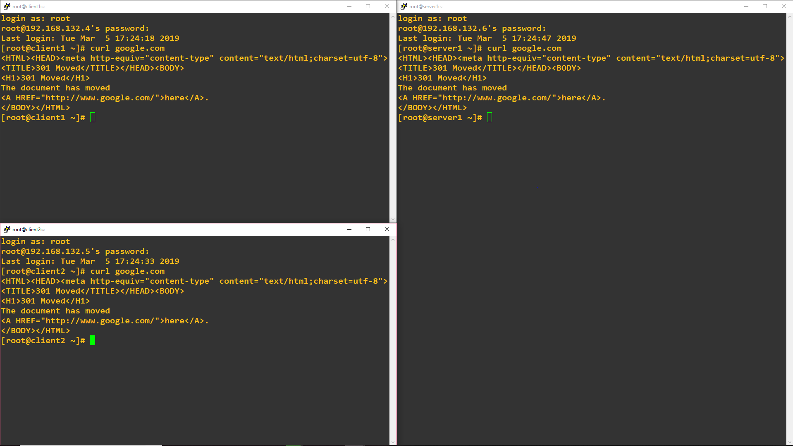
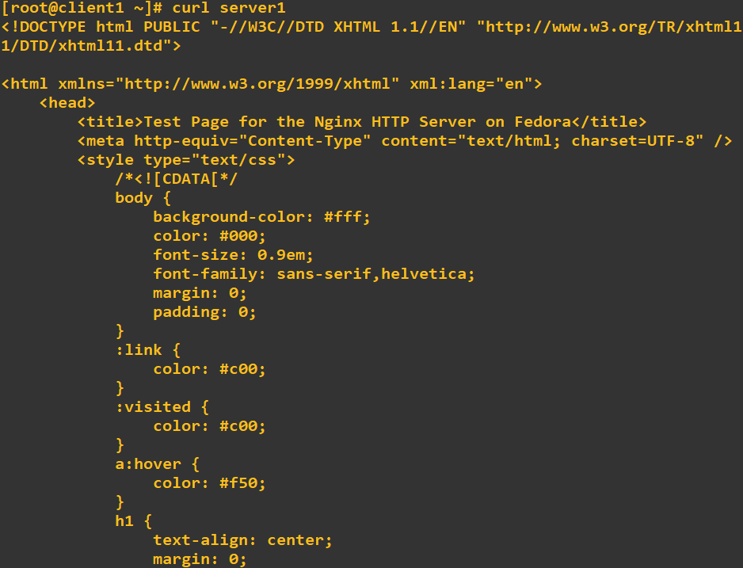

# TP6CCNA


## Configuration de OSPF

Verif config avec un ping et traceroute :
```
login as: root
root@192.168.4's password:
Last login: Tue Fed 26 10:43:41 2019 from 192.168.132.3
[root@client1 ~]# ping server1
PING server1 (10.6.202.10) 56(84) bytes of data.
64 bytes from server1 (10.6.202.10): icmp_seq=2 ttl60 time=51.2
64 bytes from server1 (10.6.202.10): icmp_seq=3 ttl60 time=49.4
64 bytes from server1 (10.6.202.10): icmp_seq=4 ttl60 time=48.9
64 bytes from server1 (10.6.202.10): icmp_seq=5 ttl60 time=52.6
^C
--- server1 ping statistics ---
5 packets transmitted, 4 received, 20% packet loss, time 4014ms
rtt min/avg/max/mdev = 48.947/50.415/52.421/3.102 ms
[root@client1 ~]# traceroute -I server1
traceroute to server1 (10.6.202.10), 30 hops max, 60 byte packets
 1 gateway (10.6.201.254)  12.245 ms 12.173 ms 12.312 ms
 2 10.6.101.1 (10.6.101.1)  34.320 ms  34.681 ms 33.986 ms
 3 10.6.101.13 (10.6.101.13) 52.768 ms  52.631 ms  53.110 ms
 4 10.6.101.5 (10.6.101.5)  74.102 ms 74.617 ms 75.147 ms
 5 server1 (10.6.202.10)  84.167 ms  84.139 ms  84.354 ms

```
## Let's end this properly

### 1. NAT : accès internet

Verif NAT activé avec un `curl 8.8.8.8` sur chacune des machines :



### 2. Un service d'infra

On peut y accèder depuis client1 avec un curl server1 à notre serveur web installé:



### 3. Serveur DHCP

Utilisation serveur DHCP :   
```
[root@client1 ~]# dhclient -v -r
Internet Systems Consortium DHCP Client 4.2.5
Copyright 2004-2013 Internet Systems Consortium.
All rights reserved.
For info, please visit https://www.isc.org/software/dhcp/

Listening on LPF/enp0s8/08:00:27:9d:7e:b9
Sending on   LPF/enp0s8/08:00:27:9d:7e:b9
Listening on LPF/enp0s3/08:00:27:06:80:31
Sending on   LPF/enp0s3/08:00:27:06:80:31
Sending on   Socket/fallback
DHCPRELEASE on enp0s3 to 10.6.201.11 port 67 (xid=0x53c11051)
[root@client1 ~]# dhclient -v
Internet Systems Consortium DHCP Client 4.2.5
Copyright 2004-2013 Internet Systems Consortium.
All rights reserved.
For info, please visit https://www.isc.org/software/dhcp/

Listening on LPF/enp0s8/08:00:27:9d:7e:b9
Sending on   LPF/enp0s8/08:00:27:9d:7e:b9
Listening on LPF/enp0s3/08:00:27:06:80:31
Sending on   LPF/enp0s3/08:00:27:06:80:31
Sending on   Socket/fallback
DHCPDISCOVER on enp0s8 to 255.255.255.255 port 67 interval 5 (xid=0x517a0807)
DHCPDISCOVER on enp0s3 to 255.255.255.255 port 67 interval 8 (xid=0x5f2ddd66)
DHCPREQUEST on enp0s3 to 255.255.255.255 port 67 (xid=0x5f2ddd66)
DHCPOFFER from 10.6.201.11
DHCPACK from 10.6.201.11 (xid=0x5f2ddd66)
bound to 10.6.201.50 -- renewal in 261 seconds.
[root@client1 ~]# ip a
1: lo: <LOOPBACK,UP,LOWER_UP> mtu 65536 qdisc noqueue state UNKNOWN group default qlen 1000
    link/loopback 00:00:00:00:00:00 brd 00:00:00:00:00:00
    inet 127.0.0.1/8 scope host lo
       valid_lft forever preferred_lft forever
    inet6 ::1/128 scope host
       valid_lft forever preferred_lft forever
2: enp0s3: <BROADCAST,MULTICAST,UP,LOWER_UP> mtu 1500 qdisc pfifo_fast state UP group default qlen 1000
    link/ether 08:00:27:06:80:31 brd ff:ff:ff:ff:ff:ff
    inet 10.6.201.50/24 brd 10.6.201.255 scope global dynamic enp0s3
       valid_lft 595sec preferred_lft 595sec
    inet6 fe80::a00:27ff:fe06:8031/64 scope link
       valid_lft forever preferred_lft forever
```
### 4. Serveur DNS

Le serveur DNS est installé, on rajoute la ligne option domain-name-servers 10.6.202.10 dans le fichier `/etc/dhcp/dhcpd.conf` de notre machine dhcp.tp6.b1 et grace à ça on peut faire la cmd `digsur` sur tt les machines.  
```
[root@client1 ~]# dig server1.tp6.b1`
 
; <<>> DiG 9.9.4-RedHat-9.9.4-72.el7 <<>> server1.tp6.b1
;; global options: +cmd
;; Got answer:
;; ->>HEADER<<- opcode: QUERY, status: NOERROR, id: 62692
;; flags: qr aa rd; QUERY: 1, ANSWER: 1, AUTHORITY: 1, ADDITIONAL: 1
;; WARNING: recursion requested but not available

;; OPT PSEUDOSECTION:
; EDNS: version: 0, flags:; udp: 4096
;; QUESTION SECTION:
;server1.tp6.b1.                        IN      A

;; ANSWER SECTION:
server1.tp6.b1.         604800  IN      A       10.6.202.10

;; AUTHORITY SECTION:
tp6.b1.                 604800  IN      NS      server1.tp6.b1.

;; Query time: 78 msec
;; SERVER: 10.6.202.10#53(10.6.202.10)
;; WHEN: mar. mars 12 15:53:19 CET 2019
;; MSG SIZE  rcvd: 73`
```

## J'ai pas fais pas 5eme partie :/
